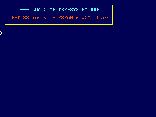
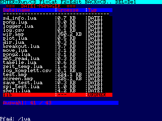
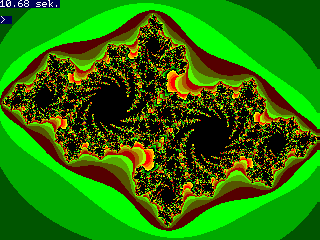
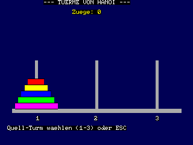
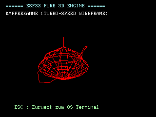
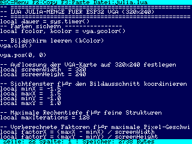

# ESP32-Lua-Computer mit TTGO VGA (8MB PSRAM)
### Lua with FabGL VGA library + PS2 PS2Controller for VGA monitor output - 2026      
### original Lua - source - code from https://www.lua.org
### angepasst von:Reinhard Zielinski <zille09@gmail.com>                                                                   
### Das Ergebnis ist ein kleiner Retro-Computer mit folgender Ausstattung:
```
-VGA Ausgabe 320x240 Pixel mit Font 6x8 - 53x30 Zeichen
-Fullscreen-Editor mit Block-Copy/Paste/Delete
-Grafikfunktionen
-SD-Karten-Zugriff
-Window-Funktion
-BMP Import/Export (Screenshot-Funktion)
```

 Startbildschirm

 Dateimanager

 Grafik-Funktion         

 Spiele

 3D - Grafiken

 Fullscreen-Editor
